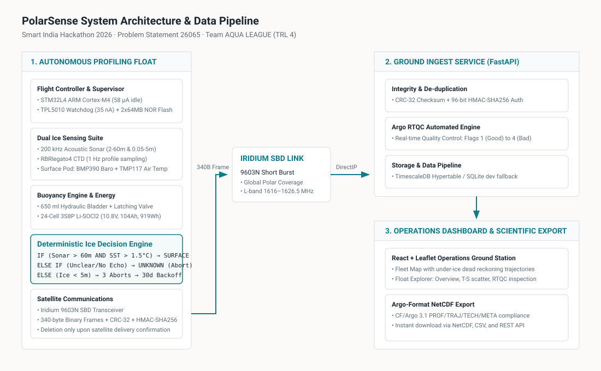

# PolarSense: Ice-Aware Autonomous Profiling Float

[](https://github.com/boomesh11/Polar-sense/actions/workflows/ci.yml)
[](https://www.sih.gov.in/)
[](#)
[-blue?style=flat-square)](#)
[](./LICENSE)

> **"Every polar float today infers ice from temperature; PolarSense measures it."**

---

### The Problem

1. Conventional polar profiling floats infer surface sea-ice solely from water temperature thresholds, causing severe false positives in cold open water and catastrophic collisions beneath newly forming ice.
2. An under-ice collision crushes satellite antennas and shears GNSS receivers, permanently terminating the instrument and losing months of irreplaceable sub-surface polar ocean observations.
3. India currently lacks domestic manufacturing capability for polar-capable profiling floats, relying on imported instruments costing **Rs 22 Lakh** per unit.

---

### System Architecture



---

### Component Status Table

| Subsystem / Component | Status Tag | Evidence & Verification |
|---|---|---|
| **Mission State Machine (7 States)** | `SIMULATED` | Host C build & execution ([`firmware/host/main_host.c`](firmware/host/main_host.c)) |
| **Ice Decision & Backoff Rules** | `MEASURED` | Automated unit tests passing ([`firmware/tests/test_ice_logic.c`](firmware/tests/test_ice_logic.c)) |
| **Telemetry Ingest & CRC/HMAC Pipeline** | `SIMULATED` | FastAPI service & round-trip pytest suite ([`ground/tests/test_round_trip.py`](ground/tests/test_round_trip.py)) |
| **Argo Real-Time QC (Flags 1–4)** | `SIMULATED` | Argo RTQC compliance suite ([`ground/ingest/qc.py`](ground/ingest/qc.py)) |
| **PostgreSQL / TimescaleDB Schema** | `TARGET` | Production hypertable schema definition ([`ground/db/schema.sql`](ground/db/schema.sql)) |
| **Argo NetCDF Exporter (PROF/TRAJ)** | `TARGET` | CF-compliant netCDF4 exporter ([`ground/ingest/netcdf_export.py`](ground/ingest/netcdf_export.py)) |
| **Operations Ground Station Dashboard** | `SIMULATED` | Multi-page React + Leaflet app running on **SYNTHETIC** data ([`src/`](src/)) |
| **Buoyancy Engine & Displacement** | `CALCULATED` | Hydrostatic displacement scripts ([`simulation/physics.py`](simulation/physics.py)) |
| **Power Budget & Mission Endurance** | `CALCULATED` | 919 Wh / 5.30 Wh per-cycle physics model ([`simulation/physics.py`](simulation/physics.py)) |
| **Hull Stress & Elastic Buckling** | `CALCULATED` | Analytical Lamé & von Mises closed-form formulas ([`hardware/hull_calcs.md`](hardware/hull_calcs.md)) |
| **Bill of Materials & Unit Economics** | `TARGET` | Detailed dual-estimate CSV allowance ([`hardware/bom.csv`](hardware/bom.csv)) |

---

### Key Design Figures

*All figures are locked to the PolarSense baseline and verified against [`simulation/check_deck_numbers.py`](simulation/check_deck_numbers.py).*

| Parameter | Specification | Status Tag |
|---|---|---|
| **Hull Dimensions** | 1300 mm length, 160 mm outer diameter, 6061-T6 aluminium | `TARGET` |
| **Depth Rating & Neutral Mass** | Rated 500 m, parks at 450 m, 25.75 kg neutral mass | `TARGET` |
| **Mission Cycle** | 10-day park-and-profile cycle; CTD profiles collected during ascent | `TARGET` |
| **Buoyancy Engine** | 650 ml hydraulic oil engine with zero-power latching solenoid valve | `TARGET` |
| **Net Buoyancy Lift** | 0.6676 kg net positive lift from 650 ml displacement in 1.027 kg/L seawater | `CALCULATED` |
| **Primary Battery Pack** | 24 Li-SOCl2 D cells in 3S8P arrangement (10.8 V nominal, 104 Ah capacity) | `TARGET` |
| **Available Energy Budget** | 919 Wh usable energy; 5.30 Wh consumed per 10-day cycle | `TARGET` |
| **Mission Endurance** | 173 cycles (~4.7 years in open water, 3.95 years under severe ice) | `CALCULATED` |
| **Claimed Operational Life** | 3.5 years (approximately 128 full scientific vertical profiles) | `TARGET` |
| **Electronics Platform** | STM32L4 flight computer, TPL5010 watchdog (35 nA), 58 µA idle current | `TARGET` |
| **Solid-State Storage** | 2 × 64 MiB NOR flash configured as a non-volatile ring buffer | `TARGET` |
| **Oceanographic Sensors** | RBRlegato4-class CTD sampling at 1 Hz; 200 kHz dual-range upward sonar | `TARGET` |
| **Surface Pod Instrumentation** | BMP390 precision barometer and TMP117 air temperature sensor | `TARGET` |
| **Navigation & Safety** | ISM330DHCX IMU, u-blox NEO-M9N GNSS, internal conductive leak probe | `TARGET` |
| **Satellite Telemetry** | Iridium 9603N SBD sending 340-byte binary frames (CRC-32 & HMAC-SHA-256) | `TARGET` |
| **Flash Retention Policy** | Profiles deleted from on-board flash only after satellite delivery confirmation | `TARGET` |
| **Ice Decision Engine** | Surface ONLY when BOTH sonar (>60m) and SST (>1.5°C) clear; any echo ambiguity counts as `UNKNOWN` causing immediate abort; 3 blocked attempts trigger a 30-day dormant backoff | `TARGET` |
| **Unit Economics** | Rs 8.25 Lakh target per unit; Rs 8.25–16.5 Lakh projected band (vs Rs 22 Lakh imported float). *Funding allowances, not supplier quotations.* | `TARGET` |

---

### What is NOT Claimed

- **TRL Level**: The project is strictly at **Technology Readiness Level 4 (TRL 4)** (laboratory benchtop integration and physics simulation).
- **Environmental Qualification**: No hydrostatic pressure qualification at 500 m, no sub-zero cold-chamber testing, and no ocean field qualification has been performed.
- **Ice Validation**: The 200 kHz acoustic echo sounder has not been validated against real multi-year sea-ice floes.
- **Argo Core Scope**: PolarSense is designed for 500 m seasonal sea-ice profiling and is **not** a replacement for standard 2000 m deep-ocean Argo floats.
- **Hardware Photography**: No physical field photos are presented; all telemetry dashboards operate on **SYNTHETIC** sample datasets.

---

### Quick Start & Verification

#### 1. Verify Design Deck Figures
```bash
python simulation/check_deck_numbers.py
```

#### 2. Run Firmware Host Simulation & Unit Tests
```bash
cd firmware
mkdir build && cd build
cmake ..
cmake --build .
./test_runner
```

#### 3. Run Ground Service & Round-Trip Telemetry Tests
```bash
pip install -r ground/requirements.txt
pytest ground/tests/ -v
```

#### 4. Launch Operations Ground Station Dashboard
```bash
npm install
npm run dev
# Dashboard available at http://localhost:5173 (runs on SYNTHETIC data)
```

---

### Team & Acknowledgements

**Team AQUA LEAGUE**  
**Smart India Hackathon 2026** · **Problem Statement 26065**  
*Ministry of Earth Sciences (MoES) / National Centre for Polar and Ocean Research (NCPOR)*
